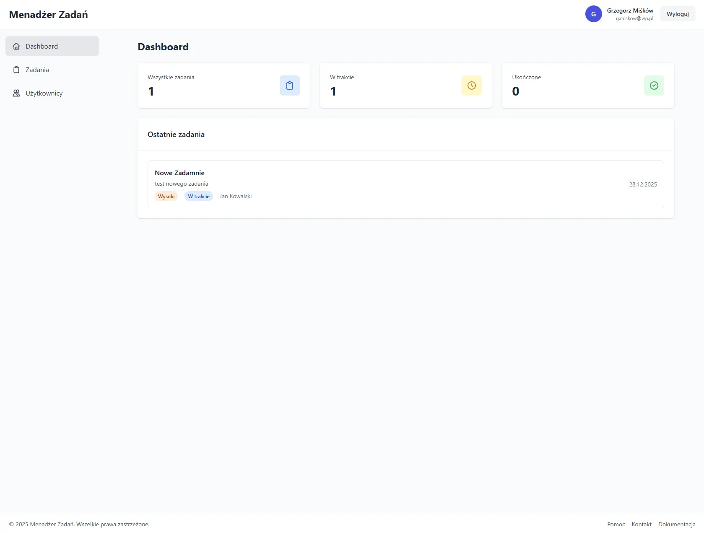

# Task Manager



Nowoczesna aplikacja do zarządzania zadaniami zbudowana w React z TypeScript, wykorzystująca Supabase jako backend.

## 🚀 Funkcje

### Zarządzanie użytkownikami
- Rejestracja i logowanie użytkowników
- System ról (użytkownik/administrator)
- Zarządzanie profilami użytkowników
- Kontrola dostępu oparta na rolach

### Zarządzanie zadaniami
- Tworzenie, edycja i usuwanie zadań
- System priorytetów (Niski, Średni, Wysoki, Pilny)
- Statusy zadań (Nie rozpoczęto, W trakcie, Testowanie, Aktualizacja, Zakończenie)
- Daty rozpoczęcia i zakończenia
- Kontrola dostępu - użytkownicy widzą tylko swoje zadania

### Interfejs użytkownika
- Responsywny design z Tailwind CSS
- Tabele z sortowaniem i paginacją
- Formularze modalne dla edycji
- Ciemny motyw nawigacji
- Intuicyjna nawigacja między sekcjami

## 🛠 Technologie

- **Frontend:** React 19, TypeScript, Vite
- **Stylizacja:** Tailwind CSS
- **Stan aplikacji:** Zustand
- **Backend:** Supabase (PostgreSQL + Auth + Edge Functions)
- **Tabele:** TanStack Table v8
- **Narzędzia:** ESLint, PostCSS, Autoprefixer

## 📦 Instalacja

### Wymagania wstępne
- Node.js (wersja 18+)
- npm lub yarn
- Konto Supabase

### 1. Klonowanie repozytorium
```bash
git clone <repository-url>
cd taskmanager
```

### 2. Instalacja zależności
```bash
npm install
```

### 3. Konfiguracja Supabase

#### a) Utwórz nowy projekt w Supabase
1. Przejdź do [Supabase Dashboard](https://app.supabase.com)
2. Utwórz nowy projekt
3. Zanotuj `SUPABASE_URL` i `SUPABASE_ANON_KEY`

#### b) Uruchom migracje
Uruchom SQL z plików migracyjnych w Supabase SQL Editor:
- `supabase/migrations/001_create_users_table.sql`
- `supabase/migrations/002_create_tasks_table.sql`

#### c) Skonfiguruj autoryzację
W ustawieniach Supabase:
1. **Settings** → **Authentication** → **Email Auth**
2. **Wyłącz** opcję "Confirm email"

#### d) Wdróż Edge Functions
```bash
# Zainstaluj Supabase CLI
npm install -g supabase

# Zaloguj się
supabase login

# Połącz z projektem
supabase link --project-ref YOUR_PROJECT_REF

# Wdróż funkcje
supabase functions deploy add-user
supabase functions deploy delete-user
supabase functions deploy add-task
supabase functions deploy delete-task
```

### 4. Konfiguracja środowiska
Utwórz plik `.env.local` w katalogu głównym projektu:
```env
VITE_SUPABASE_URL=your_supabase_url
VITE_SUPABASE_ANON_KEY=your_supabase_anon_key
```

### 5. Uruchomienie aplikacji
```bash
npm run dev
```

Aplikacja będzie dostępna na `http://localhost:5173`

## 📁 Struktura projektu

```
taskmanager/
├── src/
│   ├── components/
│   │   ├── layout/          # Komponenty layoutu
│   │   ├── tasks/           # Komponenty zadań
│   │   ├── users/           # Komponenty użytkowników
│   │   ├── Login.tsx        # Logowanie
│   │   ├── Register.tsx     # Rejestracja
│   │   └── ...
│   ├── context/             # React Context
│   ├── lib/                 # Biblioteki pomocnicze
│   ├── store/               # Zustand stores
│   ├── types/               # TypeScript typy
│   └── ...
├── supabase/
│   ├── functions/           # Edge Functions
│   └── migrations/          # Migracje bazy danych
└── ...
```

## 🔐 Bezpieczeństwo

- **Row Level Security (RLS)** aktywne na wszystkich tabelach
- Autoryzacja JWT przez Supabase Auth
- Service Role Key używany tylko w Edge Functions
- Walidacja danych po stronie klienta i serwera

## 🧪 Uruchamianie testów

```bash
npm run lint
```

## 🚀 Build produkcyjny

```bash
npm run build
npm run preview
```

## 🤝 Przyczynianie się

1. Forkuj projekt
2. Utwórz branch dla swojej funkcji (`git checkout -b feature/AmazingFeature`)
3. Commituj zmiany (`git commit -m 'Add some AmazingFeature'`)
4. Push do brancha (`git push origin feature/AmazingFeature`)
5. Otwórz Pull Request

## 📄 Licencja

Ten projekt jest licencjonowany na podstawie licencji MIT - zobacz plik [LICENSE](LICENSE) dla szczegółów.

## 👥 Autor

**Maxsoft** - [maxsoft@example.com](mailto:maxsoft@example.com)

## 🙏 Podziękowania

- [Supabase](https://supabase.com) za doskonały backend-as-a-service
- [TanStack Table](https://tanstack.com/table) za potężną bibliotekę tabel
- [Tailwind CSS](https://tailwindcss.com) za utility-first CSS framework